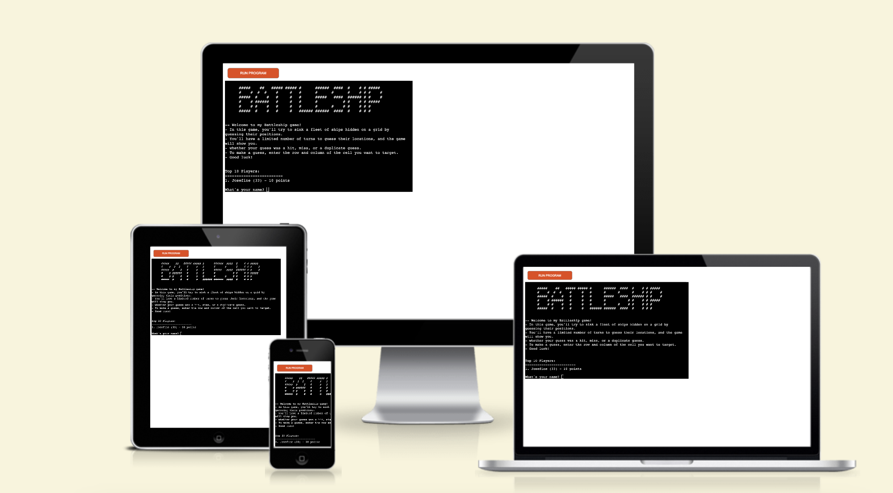
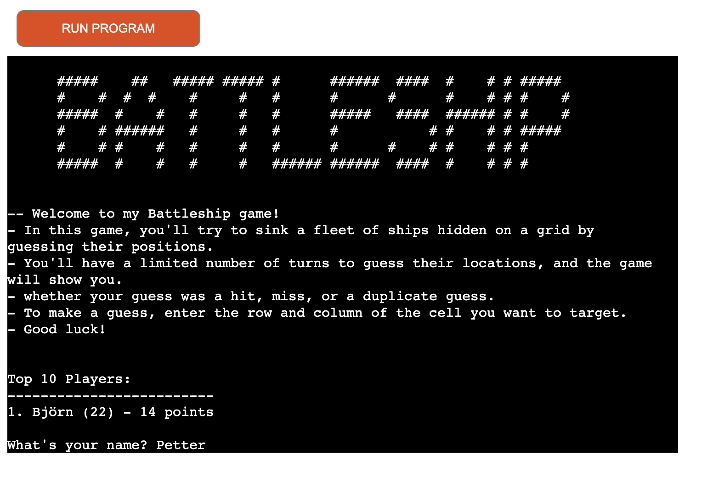
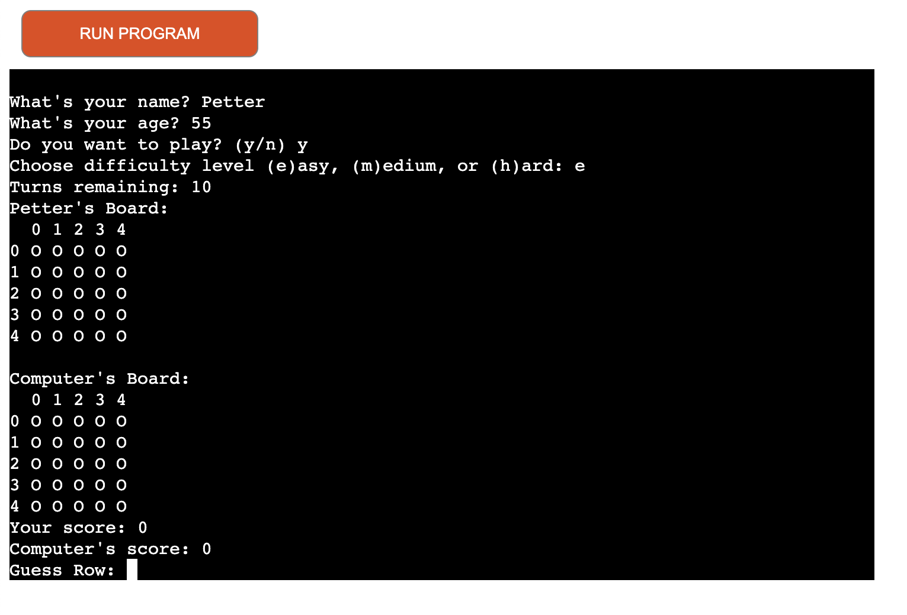

# Python Battleship Game 🗺️
Battleship is a classic grid-based strategy game where the player competes against the computer by guessing the locations of its hidden fleet of ships. The objective is to sink all of the computer's ships within a limited number of turns.

## Features

-   Choose between three difficulty levels: easy, medium, and hard
-   Random ship placement for the computer's fleet
-   Customizable fleet configuration and grid size based on the chosen difficulty level
-   Score tracking and leaderboard to save top 10 player's scores
-   Age and name input for more personalized experience

  
  

## How to Play