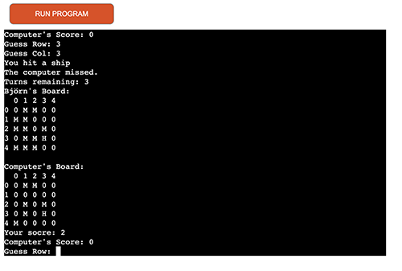

  

  <h3 align="center">Project 3 - Battleship game in Pyhton</h3>

  

    My Python project for Code Institute. A Battleship game.
     
     
    <a href="https://battleship-game-bc.herokuapp.com/" target="_blank">View Demo Website</a>
  

# Python Battleship Game 🗺️

Battleship is a classic grid-based strategy game where the player competes against the computer by guessing the locations of its hidden fleet of ships. The objective is to sink all of the computer's ships within a limited number of turns.

## Features

- Choose between three difficulty levels: easy, medium, and hard
- Random ship placement for the computer's fleet
- Customizable fleet configuration and grid size based on the chosen difficulty level
- Score tracking and leaderboard to save top 10 players' scores
- Age and name input for a more personalized experience

  
  

## How to Play

1. Clone or download this repository
2. Run the Battleship game in a Python 3 environment using the following command: `python battleship.py`
3. Follow the on-screen instructions to provide your name, age, and desired difficulty level
4. Start guessing the locations of the computer's ships by entering the row and column numbers
5. Try to sink all of the computer's ships within the given number of turns
6. You can also play it via Demo link in the top of whis README

## Game Instructions

1. In this game, you'll try to sink a fleet of ships hidden on a grid by guessing their positions.
2. You'll have a limited number of turns to guess their locations, and the game will show you whether your guess was a hit, miss, or a duplicate guess.
3. To make a guess, enter the row and column of the cell you want to target.
4. Good luck!

## Scoring

Players earn points for each successful hit. The points earned for a hit depend on the type of ship hit and the ship's size. The top 10 players' scores will be displayed on the scoreboard.

## Improvements

1. Add screenshots or a GIF of the game in action to make the README more visually appealing and help users understand the gameplay better.
2. Include a section on how to install and set up the project in different environments (Windows, macOS, and Linux).
3. Provide a link to a video demonstration or a tutorial for users who prefer visual explanations.
4. Add a "Frequently Asked Questions" section to address common questions or issues that users might face.
5. Include a "Known Issues" or "Troubleshooting" section to help users resolve problems they may encounter.
6. Add a "Roadmap" or "Future Plans" section to outline upcoming features and improvements to the game.
7. Include a "Contributors" section to acknowledge and thank contributors to the project.

## Bugs & fixes

The project bugs & fixes!

## Validator testing

- This is fun

  

## License

This project is licensed under the MIT License. See the [LICENSE](LICENSE) file for details.

## Requirements

- Python 3.x
- No additional libraries are required

## Customization

To customize the game settings, you can modify the fleet configuration, grid size, and number of turns in the `main()` function of the `battleship.py` file. The default settings are as follows:

- Easy: Grid size of 5x5, fleet consisting of a destroyer (2 cells), cruiser (3 cells), and battleship (4 cells), and 10 turns.
- Medium: Grid size of 7x7, fleet consisting of a destroyer (2 cells), cruiser (3 cells), battleship (4 cells), and aircraft carrier (5 cells), and 15 turns.
- Hard: Grid size of 10x10, fleet consisting of a destroyer (2 cells), cruiser (3 cells), battleship (4 cells), aircraft carrier (5 cells), and an additional aircraft carrier (6 cells), and 20 turns.

To customize the game further, you can adjust the ship points, ASCII art, or instructions displayed during the game.

## Contributing

If you would like to contribute to this project, please feel free to submit a pull request or open an issue on GitHub. We appreciate any suggestions or improvements to the game.

## Acknowledgments

- Thanks to the creators of the original Battleship game for inspiring this project
- Pythons documentation about PEP8 guidelines
- The art in the game is with help from [ASCII-Generator](https://ascii-generator.site/)

## Author

- Björn Centio - _Initial work_ - [Bjorne90](https://github.com/bjorne90)

## Contact

If you have any questions or suggestions, feel free to reach out to me at bjce90@gmail.com
